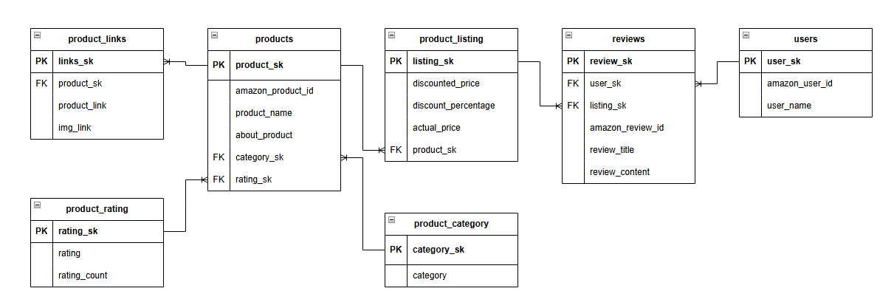
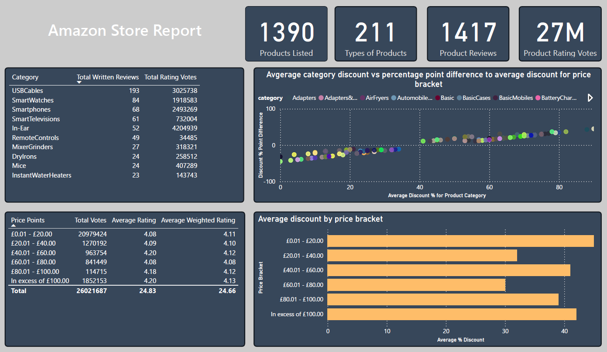

## 1. Project Overview
An end-to-end data pipeline project that analyses Amazon product listings.

**Key Skills Demonstrated:**
- Database design (ERD, normalisation to 3NF);
- SQL (DDL, data cleaning, and complex queries with CTEs / window functions); and
- Power BI (cretaing a dashboard from the queried data) 

The analysis provides insights into the following key areas:
- Engagement patterns based on product category and product price point;
- Discount strategy by price point; and
- The most heavily discounted and resilient product categories in relation to the average discount for their price point.    

## 2. Dataset & Methodology
**Source:** The dataset used for this project is the Amazon Sales Dataset from Kaggle (https://www.kaggle.com/datasets/karkavelrajaj/amazon-sales-dataset/data).

While this data represents actual Amazon listings, it was compiled generally from Amazon as a learning dataset rather than from one specific store. For the purpose of this analysis project, I've approached it as though advising a hypothetical Amazon seller who had listed all of these products on their Amazon store.  

**Initial Data Structure:** the dataset was a single denormalised CSV with 1466 rows and 16 columns. 

**Methodology:**
- **Normalisation:** Designed and implemented a 3rd Normal Form (3NF) relational database schema to eliminate redundancy and ensure data integrity.
- **Validation:** Conducted data quality checks to identify and resolve logical errors and inconsistencies.  
- **Analysis:** Created analytical views using SQL to derive insights and prepare the data for visualisation. 
- **Visualisation:** Built Power BI dashboard to display findings.

**Tools:** PostgreSQL, pgAdmin, Power BI, SQL

## 3. Database Design

### Normalisation Process
The original dataset required significant restructuring. I designed the database schema through an iterative normalisation process.

**Key Design Decisions:**

1. **Surrogate Keys:** Implemented system generated surrogate keys (e.g. product_sk, user_sk) rather than trying to use natural keys from the dataset, which ensures stability and uniqueness of the keys. 

2. **Achieving 3NF:** Resolved transitive dependencies by:
   - Separating product attributes (e.g. product name, about_product) from listing specific data (e.g. discounted_price, actual_price);
   - Isolating rating information (this was at a product level, being an overall rating for the product, rather than a review level); and
   - Creating dedicated tables for product links and categories. 

3. **Naming Conventions:** 
   - Surrogate keys: `_sk` suffix (e.g. product_sk)
   - Original id attributes: `amazon_` prefix (e.g. amazon_product_id)
   
    This removes ambiguity and clearly distinguishes between internal keys and external references.

### Final Schema


**Tables:**
- `products`: Core product information
- `product_listing`: Listing specific pricing and discount data
- `product_rating`: Aggregated rating scores
- `product_category`: Product categorisation
- `product_links`: Product and image URLs
- `reviews`: Individual user reviews
- `users`: User information

[Full design documentation and ERD progression](database-design/)


## 4. Data Cleaning

### Validation Process

I conducted data quality checks to identify logical errors and inconsistencies in the dataset. This involved writing SQL queries to validate:
- Price logic (e.g. discounted_price is less than actual_price);
- Percentage ranges (discount_percentage between 0-100);
- Rating values and counts (e.g. ensuring they are not negative values);
- NULL values in critical fields; and
- Foreign key integrity across all relationships

### Issues Identified & Resolved

1. **Discount Percentage Rounding Errors**

    **Issue:** 22 records had discount_percentage values that didn't match the calculated percentage based on actual_price and discounted_price. All errors were consistent with rounding mistakes (±1 percentage point).

    **Resolution:** Updated the affected rows using a calculated correction:
    ```sql
    UPDATE product_listing
    SET discount_percentage = ROUND((actual_price - discounted_price) / actual_price * 100, 0)
    WHERE ROUND((actual_price - discounted_price) / actual_price * 100, 0) != discount_percentage;
    ```

    **Thought process:** I considered whether this was an indication of incorrect pricing data rather than an error in the discount percentage, however the consistent small margin of error suggested a calculation/rounding issue rather than incorrect pricing data, so I therefore thought it was appropriate to update the incorrect discount percentages. 

2. **NULL Rating Counts**

    **Issue:** Two records had valid rating scores but NULL rating_count values. This is logically inconsistent, as an average rating cannot exist without underlying vote data.

    **Resolution:** These records were excluded from the analyses involving rating_count using WHERE clauses in relevant views.

    **Thought process:** Assigning an arbitrary value (such as 0) would compromise data integrity. The exclusion of two rows from a 1,466 row dataset would have a negligible impact on overall analysis.


[View all validation queries:](sql-queries/data_validation_queries.sql)

## 5. Analysis & Insights

### Dashboard Overview



### Key Metrics

The store's performance at a glance:
- **1,390** product listings across **211** product categories
- **1,417** written user reviews demonstrating active customer engagement
- **27 million** total rating votes indicating significant reach

### Business Insights

1. **Product Quality is Consistently High Across All Price Tiers**

Analysis reveals that customer satisfaction (weighted average rating being 4.1) remains consistent regardless of price point, from budget items (£0-20) to premium products (£100+). This suggests the store maintains quality standards across its entire product range.

2. **Budget Products Drive the Majority of Customer Engagement**

The £0-20 price bracket dominates customer interaction:
- **20.9 million rating votes** (80% of total votes)
- Significantly outperforms all other price tiers combined
- This  suggests the store's success is heavily dependent on high volume, low cost products. 

3. **Electronics Accessories Lead in Customer Engagement**

Top 5 categories by total engagement:
1. **USB Cables** - 3.0M rating votes, 193 reviews
2. **Smart Watches** - 1.9M votes, 84 reviews  
3. **Smartphones** - 2.5M votes, 68 reviews
4. **Smart Televisions** - 732K votes, 61 reviews
5. **In-Ear Headphones** - 4.2M votes, 52 reviews

This reveals that electronic accessories and 'smart' technologies dominate customer interest, suggesting these categories are core to the store's success, and that future marketing campaigns should focus on promoting these categories of product.

4. **Discount Strategy Varies Significantly by Price Tier**

Average discount by price bracket:
- **£0-20:** 45% discount (heavy promotional strategy)
- **£20-40:** 32% discount  
- **£40-60:** 41% discount
- **£60-80:** 30% discount
- **£80-100:** 39% discount
- **£100+:** 42% discount (premium positioning)

The discount rates remain relatively consistent across price brackets (30-45%), suggesting a uniform promotional strategy where the store competes primarily on perceived value through discounting rather than a price bracket specific approach (e.g. heavily discounted budget products and small discounts for premium products).  

5. **Outlier Categories with Non-Standard Discount Strategies**

Analysis identified 60 category average discount combinations that deviate ±30% from their price bracket average discount, revealing:

- **Over-discounted categories:** Potentially struggling products requiring heavy promotion to compete
- **Under-discounted categories:** Resilient products with strong demand that don't require aggressive pricing comapred to other products in their price range

These outliers should be further investigated to understand if they present an opportunity in the market (e.g. an under-exploited product with strong demand) or risks (e.g. failing product with weak demand).

### Technical Implementation

**Weighted Rating Calculation:**

To provide more reliable product rankings, I utilised the IMDB weighted average formula that adjusts ratings based on vote volume:

Weighted Rating = (R × v + C × m) / (v + m)
Where:
R = product's average rating
v = number of votes for the product  
C = mean rating across all products
m = 75th percentile of vote counts (threshold for "trusted" ratings)

This prevents products with few votes but perfect ratings from ranking above well-established products with thousands of ratings.

**SQL Techniques Used:**
- Common Table Expressions (CTEs) for multi-step analysis;
- Window functions to calculate average discounts by price bracket levels;
- Ordered set aggregate function to calculate 75th percentile of vote counts; 
- CASE statements to create price brackets; and
- Aggregate functions with conditions. 

[View all analysis queries:](sql-queries/power_bi_views.sql)

## 6. Limitations & Future Enhancements

### Data Limitations

**No Sales Volume Data:** The dataset contains pricing and engagement metrics (reviews, ratings) but lacks actual sales transaction data. This limits revenue analysis and prevents assessment of true business performance. Insights are based on customer engagement as an indicator for success.

**No Temporal Data:** The dataset is a snapshot without timestamps, preventing:
- Trend analysis over time;
- Seasonality identification; and
- Growth metrics

**Synthetic Dataset Constraints:** While based on actual Amazon listings, the data was compiled as a learning dataset rather than representing a real store's operations. 

### Future Enhancements

1. **Enhanced Visualisation**
- Publish interactive dashboard to Power BI Service.
- Create mobile responsive views.

2. **Sentiment Analysis**
- Apply NLP techniques to review text to extract sentiment scores.
- Create customer segmentation based on review behavior.
- Identify common themes in positive vs negative reviews.
- Correlate sentiment with engagement and rating patterns. 
